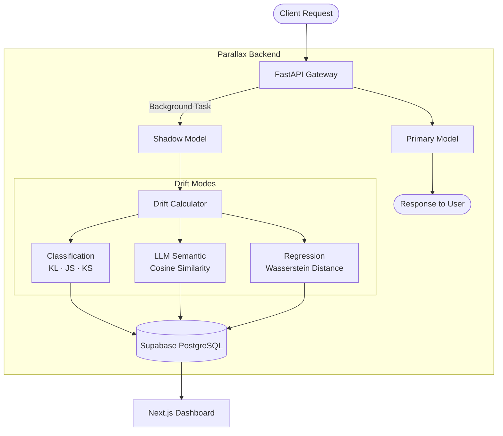

# Parallax

A model-agnostic shadow deployment framework for real-time concept drift detection across classification, LLM, and regression models.


---

## Overview

Parallax silently routes live traffic to both a primary and a shadow model simultaneously. Users only see the primary model's response. In the background, Parallax compares the two models' outputs, calculates drift scores, logs them to a database, and visualizes them on a real-time dashboard.

---

## Architecture



---

## Drift Detection Modes

| Mode | Primary Model | Shadow Model | Drift Metric |
|------|--------------|--------------|--------------|
| Classification | Random Forest | Logistic Regression | KL Divergence, JS Divergence, KS Statistic |
| LLM Semantic | LLaMA 3.1 8B | LLaMA 3.3 70B | TF-IDF Cosine Similarity |
| Regression | Random Forest Regressor | Linear Regression | Wasserstein Distance |

---

## Datasets

| Mode | Dataset | Source |
|------|---------|--------|
| Classification | PaySim — Synthetic Mobile Financial Services transactions | [Kaggle](https://www.kaggle.com/datasets/ealaxi/paysim1) |
| Regression | Hourly Energy Consumption | [Kaggle](https://www.kaggle.com/datasets/robikscube/hourly-energy-consumption) |
| LLM | Custom prompts — no external dataset required | — |

> **Note:** Dataset files are not included in this repository due to size constraints. Download them from the links above and place them in `backend/data/` before training.


---

## Tech Stack

**Backend**
- FastAPI — async gateway with background task routing
- Scikit-learn — classification and regression models
- Groq API — LLM inference (LLaMA models)
- SciPy — statistical drift calculations
- SQLAlchemy + asyncpg — async database ORM
- Supabase (PostgreSQL) — drift log persistence

**Frontend**
- Next.js 15 (App Router)
- Recharts — time-series drift visualization
- Supabase JS — real-time data fetching
- Sora (Google Fonts)

---

## Project Structure

```
Parallax/
├── backend/
│   ├── app/
│   │   ├── api/
│   │   │   ├── gateway.py          # Classification shadow gateway
│   │   │   ├── llm_gateway.py      # LLM shadow gateway
│   │   │   └── regression_gateway.py # Regression shadow gateway
│   │   ├── core/
│   │   │   ├── config.py           # Environment settings
│   │   │   └── database.py         # SQLAlchemy models + Supabase connection
│   │   ├── drift/
│   │   │   ├── calculator.py       # KL, JS, KS divergence
│   │   │   ├── llm_calculator.py   # TF-IDF cosine similarity
│   │   │   └── regression_calculator.py # Wasserstein distance
│   │   └── main.py
│   ├── data/                       # Training datasets
│   ├── models/                     # Trained .joblib model files
│   ├── primary_model.py            # Primary model server (port 8001)
│   ├── shadow_model.py             # Shadow model server (port 8002)
│   ├── train_models.py             # Classification model training
│   ├── train_regression_models.py  # Regression model training
│   └── requirements.txt
└── frontend/
    ├── app/
    │   ├── page.tsx                # Landing page
    │   ├── dashboard/              # Dashboard pages
    │   │   ├── page.tsx            # Overview
    │   │   ├── classification/
    │   │   ├── llm/
    │   │   └── regression/
    │   └── auth/                   # Sign in / Sign up
    ├── components/
    │   └── Sidebar.tsx
    └── lib/
        └── supabase.ts
```

---

## Local Setup

### Prerequisites

- Python 3.10+
- Node.js 18+
- Supabase account
- Groq API key

### Backend

```bash
cd backend
python -m venv venv
venv\Scripts\activate      # Windows
pip install -r requirements.txt
```

Create `.env` from `.env.example`:

```env
PRIMARY_MODEL_URL=http://localhost:8001
SHADOW_MODEL_URL=http://localhost:8002
DRIFT_THRESHOLD=0.1
APP_ENV=development
DATABASE_URL=your_supabase_connection_string
GROQ_API_KEY=your_groq_api_key
PRIMARY_LLM_MODEL=llama-3.1-8b-instant
SHADOW_LLM_MODEL=llama-3.3-70b-versatile
```

Train models and start servers:

```bash
python train_models.py
python train_regression_models.py

# Three separate terminals
python primary_model.py        # Port 8001
python shadow_model.py         # Port 8002
uvicorn app.main:app --reload  # Port 8000
```

### Frontend

```bash
cd frontend
npm install
```

Create `.env.local`:

```env
NEXT_PUBLIC_SUPABASE_URL=your_supabase_url
NEXT_PUBLIC_SUPABASE_ANON_KEY=your_supabase_anon_key
```

```bash
npm run dev
```

---

## API Endpoints

| Method | Endpoint | Description |
|--------|----------|-------------|
| `POST` | `/api/v1/predict` | Classification shadow prediction |
| `POST` | `/api/v1/llm-predict` | LLM semantic drift |
| `POST` | `/api/v1/regression-predict` | Regression drift |
| `GET` | `/health` | Health check |

---

## License

MIT
